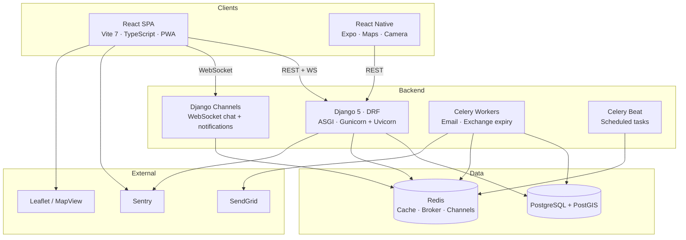

# BookSwap

A location-aware, peer-to-peer physical book exchange platform. Users list books they're willing to swap, discover nearby listings on a map, request exchanges, chat to arrange meetups, complete swaps, and build trust through ratings. MVP targets Amsterdam.

## Architecture



## Tech Stack

| Layer | Technology |
|---|---|
| **Backend** | Django 5 (ASGI) · DRF · Simple JWT (httpOnly cookies) · Django Channels · Celery + Beat · PostGIS / GeoDjango |
| **Frontend** | React 19 · TypeScript · Vite 7 · Zustand · TanStack Query v5 · React Hook Form + Zod · Tailwind v4 · i18next (en/fr/nl) · Leaflet · PWA |
| **Mobile** | React Native · Expo · React Navigation · Maps · Camera (barcode scan) |
| **Shared** | `@bookswap/shared` — Zod schemas, TypeScript types, constants |
| **Database** | PostgreSQL + PostGIS · Redis (cache, Celery broker, Channels layer) |
| **Infra** | Docker · Nginx · GitHub Actions CI/CD · Cloudflare Tunnel · Self-hosted Pi5 runner |
| **Monitoring** | Sentry (backend + frontend) · drf-spectacular (Swagger + ReDoc) |

## Repository Structure

```
bookswap/
├── backend/              # Django API, Celery tasks, WebSocket consumers
├── frontend/             # React SPA (Vite, Yarn 4)
├── mobile/               # React Native app (Expo) — planned
├── packages/
│   └── shared/           # Shared Zod schemas, types, constants
├── infra/                # Hosting config, backup scripts — planned
├── docs/                 # PRD, architecture, gap analyses, action plans
├── .github/workflows/    # CI (main), deploy (staging + production)
├── AGENTS.md             # Agent/developer workflow guide
└── CONTRIBUTING.md       # Team contribution standards
```

## Quick Start

### Prerequisites

- Python 3.11+ · Node 22+ · PostgreSQL 15+ (with PostGIS) · Redis 7+
- Yarn 4 (`corepack enable`) for the frontend
- npm for shared packages
- GDAL/GEOS libraries (GeoDjango requirement)

### Backend

```bash
cd backend
python -m venv .venv && source .venv/bin/activate
pip install -r requirements.txt
cp .env.example .env          # edit with your local values
python manage.py migrate
python manage.py createsuperuser
python manage.py runserver     # API at http://localhost:8000
```

Start the Celery worker (separate terminal):

```bash
cd backend
celery -A config worker -l info
```

API docs available at `http://localhost:8000/api/schema/swagger-ui/` (Swagger) and `http://localhost:8000/api/schema/redoc/` (ReDoc).

### Frontend

```bash
cd frontend
yarn install
cp .env.example .env.local    # set VITE_API_URL=http://localhost:8000
yarn dev                       # SPA at http://localhost:3070
```

### Shared Package

```bash
cd packages/shared
npm install
npm test                       # Vitest schema tests
```

## Testing

| Layer | Command | Framework |
|---|---|---|
| Backend | `cd backend && pytest` | pytest + pytest-django |
| Frontend | `cd frontend && yarn test:run` | Vitest + RTL + MSW |
| Frontend E2E | `cd frontend && yarn e2e` | Playwright |
| Shared | `cd packages/shared && npm test` | Vitest |

Run the full CI check locally:

```bash
# Backend
cd backend && ruff check . && ruff format --check . && pytest --cov

# Frontend
cd frontend && yarn type-check && yarn lint && yarn stylelint && yarn test:run --coverage
```

## Deployment

- **CI** runs on push to `main` — lints, tests, builds, and E2E for all layers
- **Staging** deploys on push to `staging` branch — self-hosted Pi5 runner, Docker Compose
- **Production** deploys on push to `production` branch — same Pi5, separate Docker stack

See each sub-project's README for detailed configuration:

- [Backend README](backend/README.md) — settings, user model, nimoh-base integration
- [Frontend README](frontend/README.md) — env vars, Docker, PWA, testing
